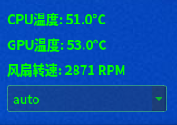

# ThinkPad Fan Control

轻量级的ThinkPad风扇控制工具，实时监控硬件温度并支持手动调节风扇转速。



## 主要功能

- 🖥 实时显示CPU/GPU温度
- 🌀 风扇转速监控（RPM）
- 🎚 支持多种控制模式：
  - 自动模式（auto）
  - 手动档位（0-7）
  - 全速模式（full-speed）
- 🖌 半透明极简UI设计
- 🚨 温度阈值颜色警示（>100℃变红）

## 依赖项

- Qt5 Core & Widgets (≥5.15)
- lm-sensors
- thinkpad_acpi内核模块

```bash
sudo apt install qtbase5-dev lm-sensors cmake
```

## 注意
需要加载thinkpad_acpi内核模块：
```bash
sudo modprobe thinkpad_acpi fan_control=1
```